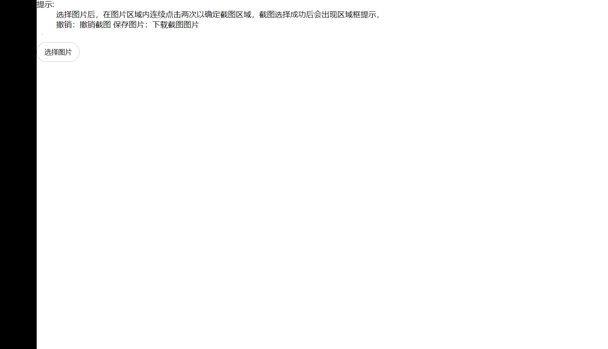

***canvas-jietu.html***




```java
代码区域
public void args[String](){}
sdfsadfdddddddddddddddddddddddddddddddddddd
dddddddddddddddddddddddddddddddddddddddddddddddddddddddd
```
> [第一行文字](https://www.baidu.com/)
1. 项目一
   - aaa
2. 项目二
   * bbb
3. 项目三
   - ccc
   3.1. ccc
   - ccc

标题文字 ---
---
## 标题文字

`文字颜色使用：`

`$\color{red}{红色}$` $\color{red}{红色}$

`中文混合使用：`
$\color{red}{红}\color{orange}{橙}\color{yellow}{黄}\color{green}{绿}\color{cyan}{青}\color{blue}{蓝}\color{purple}{紫}$

`字符使用会变为衬线体加斜体：`
$\color{#4285f4}{G}\color{#ea4335}{o}\color{#fbbc05}{o}\color{#4285f4}{g}\color{#34a853}{l}\color{#ea4335}{e}$

color | 颜色 | 颜色
-- | -- | -- |
red | 红色 | $\color{red}{红}$
blue | 蓝色 | $\color{blue}{蓝}$
~~注脚类似这样~~[^123]
[^123]:aaa
---
`复制` <kbd>ctrl</kbd> + <kbd>c</kbd> 
***
$$
\mathbf{V}_1 \times \mathbf{V}_2 =  \begin{vmatrix} 
\mathbf{i} & \mathbf{j} & \mathbf{k} \\
\frac{\partial X}{\partial u} &  \frac{\partial Y}{\partial u} & 0 \\
\frac{\partial X}{\partial v} &  \frac{\partial Y}{\partial v} & 0 \\
\end{vmatrix}
$$

<em>强调文本</em><br>
<strong>加粗文本</strong><br>
<dfn>定义项目</dfn><br>
<code>一段电脑代码fdgsdags</code><br>
<samp>计算机样本</samp><br>
<kbd>ctrl</kbd><br>
<var>变量aaa</var>