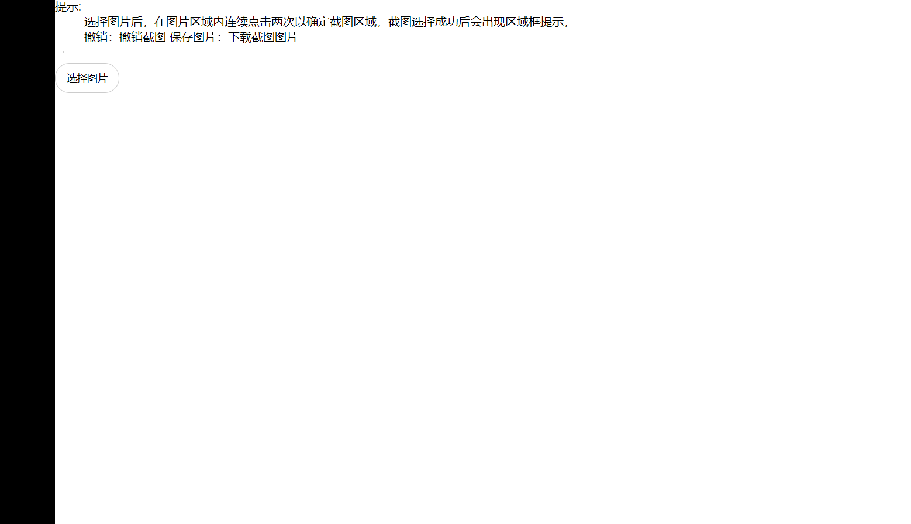

### canvas-jietu.html
---
canvas - 图片展示及裁剪
<br>


#### 效果演示：


```javascript
思路：

    1. 选择图片并获取图片信息

    2. 渲染canvas

    3. 监听canvas区域是否被连续点击 - 截图

    4. 获取截图区域canvas

    5. 绘制点击区域图片框

    6. 动态生成a标签，利用其download属性，下载截图图片

```

### table固定表头
---
table - 固定表头、自定义单元格宽度 - table.html

<br>
> **愿** - 永远没有bug

> 不介意的话，给个 **小星星** ~~

### 图片懒加载虚拟列表
---
`lazy-virtual-list-demo.html` 展示固定行高虚拟列表与图片懒加载的组合。组件位于 `js/lazy-virtual-list.js`：只渲染视口附近的列表项，并使用 `IntersectionObserver` 在图片进入滚动容器可视区域（可通过 `rootMargin` 配置，例如 `100px 0px`）时才赋值图片 `src`。

```javascript
var list = new LazyVirtualList({
    container: document.getElementById('list'),
    items: [{ title: '标题', image: 'https://example.com/photo.jpg', alt: '说明' }],
    itemHeight: 111,     // 固定行高，虚拟定位的计算依据
    overscan: 4,         // 视口上下额外渲染的行数
    rootMargin: '100px 0px' // 提前进入该边界即加载图片
});

// 不再使用时释放监听器与 DOM。
list.destroy();
```
